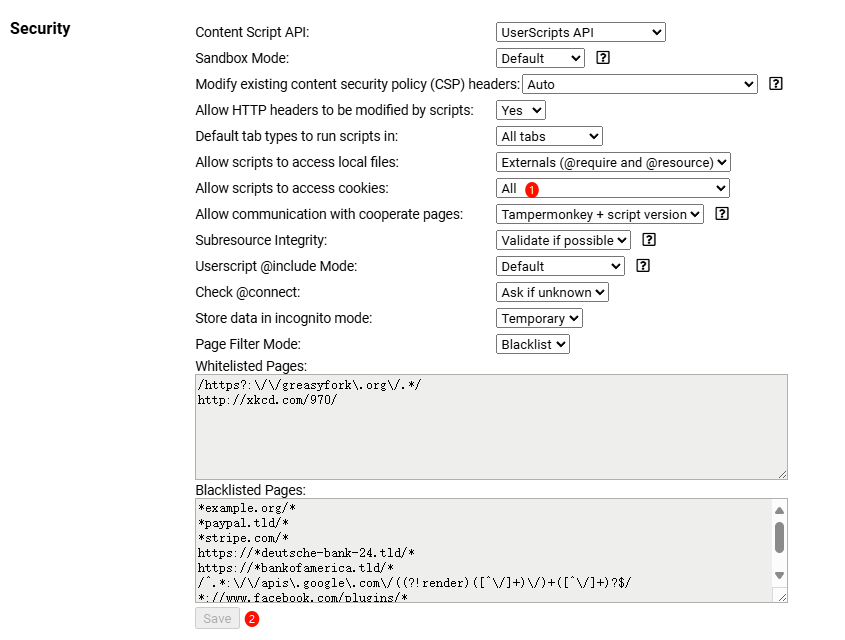

# Cookie-share Chrome/Edge/Firefox Extension/Tampermonkey Script

*Note: For learning and communication purposes only. Commercial use is strictly prohibited. Please delete within 24 hours. Distribution on social platforms is forbidden. If you find this project helpful, please give it a star. It helps a lot, thank you!*

[](https://github.com/fangyuan99/cookie-share)
   

**If you have questions, please check [issues](https://github.com/fangyuan99/cookie-share/issues) | [discussions](https://github.com/fangyuan99/cookie-share/discussions) first.**

[English](./README.md) | [简体中文](./README_CN.md) | [Update Log](./update.md)

---

## Overview

Cookie-share is a Chrome/Edge/Firefox extension (also available as a Tampermonkey script) that allows users to send and receive cookies between different devices or browsers. It can be used for **multiple account switching, video membership sharing, community subscription sharing**, and other scenarios. The backend uses self-hosted Cloudflare Worker or Node.js server to ensure data security.


---


---


[Tampermonkey Script One-Click Install (Recommended)](https://github.com/fangyuan99/cookie-share/raw/refs/heads/main/tampermonkey/cookie-share.user.js) | [Extension Download (Not Recommended, No Maintenance)](https://github.com/fangyuan99/cookie-share/releases)

### Effects and Use Cases
**Many websites don't support multiple account switching, don't want to log out and log in again?**

**Have a video membership subscription, tired of scanning QR codes for friends?**

**Joined a community platform, want to share costs with classmates?**

**Simply too lazy to take out your phone or enter passwords when switching devices?**

1. Go to the homepage of a logged-in website (any address with cookies works)
2. Click the extension icon, customize an ID (only letters and numbers supported), send the cookie
3. On devices without login, visit the login page, use the ID you just created to get cookies, wait for the extension to show successful cookie retrieval and setup, then refresh the page

Tested websites:
1. Certain community platforms
2. Certain video platforms
3. Certain L sites

## Features

- Generate random unique IDs for cookie sharing
- Send cookies from current tab to server
- Receive and set cookies from server to current tab
- Save cookies locally without backend (added in v0.1.0)
- Manage cookies with Cookie List (local and cloud data)
- Admin features for managing stored cookies
- Due to greater extension permissions, can support `HTTPOnly` cookies that JS cannot access

## Usage Instructions

### Tampermonkey Script Usage (Recommended)

1. Install [Tampermonkey](https://www.crxsoso.com/webstore/detail/dhdgffkkebhmkfjojejmpbldmpobfkfo) or other script managers
2. [One-Click Install](https://github.com/fangyuan99/cookie-share/raw/refs/heads/main/tampermonkey/cookie-share.user.js) | [Mirror](https://github.site/fangyuan99/cookie-share/raw/refs/heads/main/tampermonkey/cookie-share.user.js)
3. If you encounter cookie permission issues, please enable it in Tampermonkey settings

1. Send Cookie from logged-in browser page
2. Accept Cookie on non-logged-in browser page
3. Note: Don't add `/` after the address, example: `https://your-worker-name.your-subdomain.workers.dev/{PATH_SECRET}`

### Extension Usage
1. Enable browser developer mode:
   - Chrome/Edge: Visit `chrome://extensions/`
   - Firefox: Visit `about:debugging#/runtime/this-firefox`
2. Load extension:
   - Chrome/Edge: Drag `cookie-share.zip` directly into browser
   - Firefox: Temporarily load `cookie-share.xpi` file or install from Firefox Add-ons
3. Click Cookie-share icon in browser toolbar
4. Send Cookie from logged-in browser page
5. Accept Cookie on non-logged-in browser page
6. Note: Don't add `/` after the address, example: `https://your-worker-name.your-subdomain.workers.dev/{PATH_SECRET}`

### Local Use Without Backend

As of v0.1.0, Cookie-share now supports local storage functionality. This means you can use the extension without setting up a backend server:

- Enable the "Save to local" checkbox to store cookies locally
- The Cookie List now distinguishes between local and cloud data
- Perfect for personal use on a single device or when privacy is a top concern

For sharing cookies between different devices or browsers, you'll still need to set up a backend as described below.

### Backend Deployment Guide


#### Option 1: Cloudflare Worker (Recommended)

[](https://deploy.workers.cloudflare.com/?url=https://github.com/fangyuan99/cookie-share&env=ADMIN_PASSWORD&env=PATH_SECRET&kv=COOKIE_STORE)


1. [Register](https://dash.cloudflare.com/sign-up) Cloudflare account and create a Worker
2. Copy contents of [_worker.js](./_worker.js) to newly created Worker
3. Add following environment variables in Cloudflare Worker settings:
   - `ADMIN_PASSWORD`: Set a strong password for accessing admin endpoints
   - `PATH_SECRET`: Set a strong string to prevent brute force attacks
   - `COOKIE_STORE`: Create a KV namespace for storing cookie data
4. Bind KV namespace in Worker settings:
   - Variable name: `COOKIE_STORE`
   - KV namespace: Select your created KV namespace
5. Save and deploy Worker

If you need higher performance or more control over data storage, you can deploy a standalone Node.js server:


#### Option 2: Node.js Server

*Note: Self-hosted servers may be attacked and other security issues, please take your own risk!*

1. [Clone](https://github.com/fangyuan99/cookie-share-server) cookie-share-server repository
2. Use `npm install` to install dependencies
3. Create `.env` file with the following variables:

   - `PORT`: Server port (default: 3000)
   - `ADMIN_PASSWORD`: Set a strong password for admin access
   - `PATH_SECRET`: Set a strong string to prevent brute force attacks
   - `DB_PATH`: Path to SQLite database file (default: ./data/cookie_share.db)
4. Start the server with `npm start`
5. Access the server at `http://your-server-ip:port/{PATH_SECRET}`

The Node.js server implementation offers these advantages:
- Cookie encryption for enhanced security
- Persistent SQLite database storage
- No request limits or storage quotas
- Self-hosted with complete control over your data

## Security Considerations

- Ensure `ADMIN_PASSWORD` is set to a strong password and changed regularly
- Don't hardcode `ADMIN_PASSWORD` in code, always use environment variables
- Regularly review stored data, delete unnecessary cookie data
- Consider setting expiration times for cookie data to reduce risk of storing sensitive information long-term
- Use `PATH_SECRET` in worker config to prevent brute force attacks
- Set complex project names and disable built-in workers.dev domain

## Backend API Endpoints

**If `/{PATH_SECRET}/admin/*` endpoints have issues, check if X-Admin-Password is added or use CF official KV management page**

Both backend implementations provide the following endpoints:

Note: Add `X-Admin-Password: yourpassword`

Example:

`/{PATH_SECRET}/admin/list-cookies`

```sh
curl --location --request GET 'https://your-backend-address/{PATH_SECRET}/admin/list-cookies' \
--header 'X-Admin-Password: yourpassword'
```

`/{PATH_SECRET}/admin/delete`

```sh
curl --location --request DELETE 'https://your-backend-address/{PATH_SECRET}/admin/delete?key={yourid}' \
--header 'X-Admin-Password: yourpassword'
```

Available endpoints:
- `POST /{PATH_SECRET}/send-cookies`: Store cookies associated with unique ID
- `GET /{PATH_SECRET}/admin`: Access admin management page
- `GET /{PATH_SECRET}/admin/list-cookies`: List all stored cookie IDs and URLs
- `GET /{PATH_SECRET}/admin/list-cookies-by-host`: List cookies filtered by hostname
- `DELETE /{PATH_SECRET}/admin/delete`: Delete data for given key
- `PUT /{PATH_SECRET}/admin/update`: Update data for given key
- `OPTIONS /{PATH_SECRET}/`: Handle CORS preflight requests

Admin management page provides user-friendly interface for managing cookies and other data. Includes viewing all stored cookies, creating new cookie entries, updating existing cookies, and deleting individual cookies or all stored data.

To access admin page, navigate to `https://your-backend-address/{PATH_SECRET}/admin` in browser. Admin password required before accessing management interface.

**Admin endpoints require authentication using admin password.**

## File Structure

- `manifest.json`: Extension configuration file
- `popup.html`: HTML structure for extension popup
- `popup.js`: JavaScript for handling user interactions and cookie operations
- `style.css`: CSS styles for popup
- `_worker.js`: Cloudflare Worker script for backend operations

## Development

Modifying extension:

1. Edit relevant files (`popup.html`, `popup.js`, `style.css`)
2. Reload extension in Chrome to see changes

Modifying backend:

1. For Cloudflare Worker: Edit `_worker.js` file and deploy updated Worker to Cloudflare
2. For Node.js server: Edit files in the cookie-share-server repository

## Future Development Plans

- Future updates will focus on Tampermonkey script, extension temporarily not updated

## Contributions

[aBER0724 (aBER)](https://github.com/aBER0724) - Contributed initial Tampermonkey script version

Contributions welcome! Feel free to submit Pull Requests.

## Star History

[](https://star-history.com/#fangyuan99/cookie-share&Date)

## License

MIT
