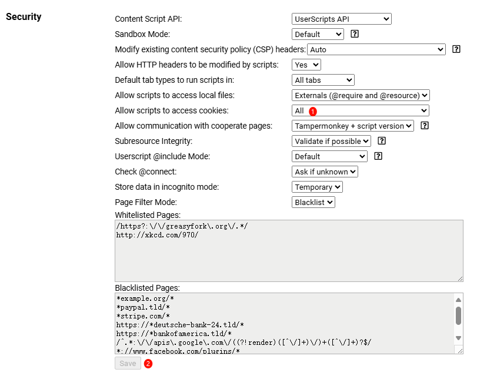

# Cookie-share

### Cross-device Cookie Sharing via Tampermonkey

   

&nbsp;

English | [简体中文](./README_CN.md) | [Changelog](./update.md)

&nbsp;

*Note: For learning and communication purposes only. Commercial use is strictly prohibited. Please delete within 24 hours. Distribution on social platforms is forbidden. If you find this project helpful, please give it a star. It helps a lot, thank you!*

**If you have questions, please check [Issues](https://github.com/fangyuan99/cookie-share/issues) | [Discussions](https://github.com/fangyuan99/cookie-share/discussions) first.**

## Why Cookie-share?

Many websites don't support multi-account switching, and sharing login sessions across devices or browsers usually means scanning QR codes, copying passwords, or manually exporting cookies. There is no simple, unified way to transfer a login session from one browser to another.

**Cookie-share** solves this with a single Tampermonkey script. Send your cookies from a logged-in browser, receive them on any other device or browser with one click — no passwords, no QR codes, no manual editing. The backend is fully self-hosted (Cloudflare Worker or Node.js), so your data stays under your control.

- **One Script, All Sites** — Works on any website with cookie-based authentication
- **Cross-device Sharing** — Share login sessions between desktops, laptops, and mobile browsers
- **Local-only Mode** — Save cookies locally without any backend, perfect for single-device multi-account switching
- **HTTPOnly Support** — Access `HTTPOnly` cookies that ordinary page JS cannot reach
- **Self-hosted Backend** — Cloudflare Worker (D1) or Node.js server, your data never touches third-party services
- **Encrypted Transport** — All cloud operations use `TRANSPORT_SECRET` encrypted envelopes

## Screenshots

  
  
<em>Main Panel — Send, Receive Cookies & Preferences</em>

   
  
  
<em>Cookie List — Manage Local & Cloud Data</em>

## Features

### Core

- Generate random unique IDs for cookie sharing
- Send cookies from current tab to server
- Receive and set cookies from server to current tab
- Support `HTTPOnly` cookies that ordinary page JS cannot access
- Admin panel for managing all stored cookies

### Storage

- Save cookies locally without backend (v0.1.0+)
- Manage cookies with Cookie List (local and cloud data)
- Cloud storage via self-hosted Cloudflare Worker (D1) or Node.js server

### UI & Themes

- Dual theme support: Claude (warm light) and Dark (luxury gold) with one-click switching (v0.4.0+)
- Userscript config export/import via Base64 clipboard (v0.3.1+)

---

## Quick Start

1. **Install**: Install [Tampermonkey](https://www.crxsoso.com/webstore/detail/dhdgffkkebhmkfjojejmpbldmpobfkfo), then [one-click install the script](https://github.com/fangyuan99/cookie-share/raw/refs/heads/main/tampermonkey/cookie-share.user.js)
2. **Send**: On a logged-in page, open the Cookie-share panel, set a custom ID, and click "Send Cookie"
3. **Receive**: On another device/browser, visit the same site's login page, enter the same ID, and click "Receive Cookie", then refresh

> For local-only use (no backend), just enable the "Save to local" checkbox. For cross-device sharing, deploy a backend first — see below.

---

## Usage Instructions

### Tampermonkey Script

1. Install [Tampermonkey](https://www.crxsoso.com/webstore/detail/dhdgffkkebhmkfjojejmpbldmpobfkfo) or another script manager
2. [One-Click Install](https://github.com/fangyuan99/cookie-share/raw/refs/heads/main/tampermonkey/cookie-share.user.js)
3. If you encounter cookie permission issues, enable it in Tampermonkey settings:
   
4. Send Cookie from a logged-in browser page
5. Receive Cookie on a non-logged-in browser page
6. Note: Don't add `/` at the end of the address, example: `https://your-worker-name.your-subdomain.workers.dev/{PATH_SECRET}`
7. If you use a Cloudflare Worker backend, the userscript only needs the address and `Transport Secret`. `send/receive`, cloud list, and cloud delete all use `TRANSPORT_SECRET`
8. Management panel: `https://your-worker-name.your-subdomain.workers.dev/{PATH_SECRET}/admin`, log in with `ADMIN_PASSWORD`

### Local Use Without Backend

As of v0.1.0, Cookie-share supports local storage. You can use the script without a backend server:

- Enable the "Save to local" checkbox to store cookies locally
- The Cookie List distinguishes between local and cloud data
- Perfect for personal use on a single device or when privacy is a top concern

For sharing cookies between different devices or browsers, you'll need to set up a backend as described below.

---

## Backend Deployment

### Option 1: Cloudflare Worker + D1 (Recommended)

> **Warning: Starting from v0.4.1, the backend uses D1 database and is NOT compatible with older versions (KV). Upgrading requires redeployment and data migration.**

#### One-click deploy (recommended):

1. Click the Deploy button above and authorize Cloudflare
2. Fill in `ADMIN_PASSWORD`, `PATH_SECRET`, and `TRANSPORT_SECRET` in the deploy form
3. Complete deployment. Cloudflare will automatically create and bind the D1 database as `COOKIE_DB`
4. No manual KV or D1 setup is required. The Worker will create the required tables on first request
5. Use `https://your-worker-domain/{PATH_SECRET}` as the backend address in the userscript

#### Deploy locally with Wrangler:

1. Install dependencies with `npm install`
2. Run `npx wrangler login`
3. Copy `.dev.vars.example` to `.dev.vars` for local development
   - If `.dev.vars` is missing, `wrangler dev` falls back to `PATH_SECRET=dev`, `ADMIN_PASSWORD=dev-password`, and `TRANSPORT_SECRET=dev-transport-secret` on localhost only
4. Before production deploy, set remote secrets:
   - `npx wrangler secret put ADMIN_PASSWORD`
   - `npx wrangler secret put PATH_SECRET`
   - `npx wrangler secret put TRANSPORT_SECRET`
5. Deploy with `npm run deploy`
6. Optional: run `npm run db:migrate` after the first deploy if you want Wrangler-managed migration metadata applied immediately

The repository declares the D1 binding in [wrangler.jsonc](./wrangler.jsonc), so Cloudflare can provision and bind the database automatically during deployment.

### Option 2: Node.js Server

*Note: Self-hosted servers may be attacked. Please take your own risk!*

Node.js `22.5.0+` is required because the embedded server uses the built-in `node:sqlite` module.

1. Enter the embedded server directory with `cd server`
2. Install dependencies with `npm install`
3. Copy `.env.example` to `.env`
4. Set the following variables in `.env`:
   - `PORT`: Server port (default: 3000)
   - `ADMIN_PASSWORD`: Set a strong password for admin access
   - `PATH_SECRET`: Set a strong string to prevent brute force attacks
   - `TRANSPORT_SECRET`: Set a strong string for encrypted userscript transport
   - `DB_PATH`: Path to SQLite database file (default: ./data/cookie_share.db)
5. Start the server with `npm run dev` for development, or `npm run build && npm start` for production
6. Access the server at `http://your-server-ip:port/{PATH_SECRET}`

Advantages of the Node.js server:

- Cookie encryption for enhanced security
- Persistent SQLite database storage
- No request limits or storage quotas
- Self-hosted with complete control over your data

---

## Security Considerations

- Ensure `ADMIN_PASSWORD` is set to a strong password and changed regularly
- Ensure `TRANSPORT_SECRET` is long and random, and rotate it independently from the admin password
- Don't hardcode `ADMIN_PASSWORD` in code, always use environment variables
- Don't reuse `ADMIN_PASSWORD` as the transport encryption secret
- Regularly review stored data in D1 and delete unnecessary cookie data
- Consider setting expiration times for cookie data to reduce risk of storing sensitive information long-term
- Use `PATH_SECRET` in worker config to prevent brute force attacks
- Set complex project names and disable built-in workers.dev domain

---

## FAQ

Why can't I get HTTPOnly cookies?

Make sure the relevant permission is enabled in Tampermonkey settings. Go to Tampermonkey Dashboard → Settings → and ensure cookie access is allowed for the script.

Do I need a backend to use Cookie-share?

No. Since v0.1.0, you can use Cookie-share in local-only mode by enabling the "Save to local" checkbox. A backend is only required for cross-device/cross-browser sharing.

What's the difference between ADMIN_PASSWORD, PATH_SECRET, and TRANSPORT_SECRET?

- `PATH_SECRET`: Part of the URL path, prevents unauthorized access to your Worker endpoints
- `ADMIN_PASSWORD`: Used to authenticate on the admin management page
- `TRANSPORT_SECRET`: Used to encrypt data in transit between the userscript and the Worker

The userscript only needs `TRANSPORT_SECRET`. The admin page only needs `ADMIN_PASSWORD`. They should be different values.

I upgraded to v0.4.1+ but my old data is gone?

v0.4.1 switched from Cloudflare KV to D1 database. The data formats are incompatible. You need to redeploy the Worker and re-send your cookies. There is no automatic migration from KV to D1.

---

Backend API Endpoints

**If `/{PATH_SECRET}/admin/*` endpoints have issues, verify that `X-Admin-Password` is present and that `ADMIN_PASSWORD` and `PATH_SECRET` are configured correctly.**

Both backend implementations provide the following endpoints:

Note:
- `GET /{PATH_SECRET}/admin` is plain HTML
- `OPTIONS` remains plain CORS preflight
- Userscript JSON endpoints use an encrypted envelope based on `TRANSPORT_SECRET`
- Admin page JSON endpoints use `ADMIN_PASSWORD` for both authentication and client-side encryption
- The userscript and admin page handle encryption automatically; plain `curl` examples are no longer sufficient unless you implement the matching client-side encryption

Available endpoints:
- `POST /{PATH_SECRET}/send-cookies` — Store cookies associated with unique ID
- `GET /{PATH_SECRET}/receive-cookies/{id}` — Receive cookies for a given ID
- `GET /{PATH_SECRET}/list-cookies-by-host/{host}` — Userscript cloud list endpoint
- `DELETE /{PATH_SECRET}/delete?key={id}` — Userscript cloud delete endpoint
- `GET /{PATH_SECRET}/admin` — Open the admin UI shell
- `GET /{PATH_SECRET}/admin/list-cookies` — List all stored cookie IDs and URLs
- `GET /{PATH_SECRET}/admin/list-cookies-by-host` — List cookies filtered by hostname
- `POST /{PATH_SECRET}/admin/create` — Create a record from the admin page
- `DELETE /{PATH_SECRET}/admin/delete` — Delete data for given key
- `PUT /{PATH_SECRET}/admin/update` — Update data for given key
- `GET /{PATH_SECRET}/admin/export-all` — Export all records as encrypted JSON
- `POST /{PATH_SECRET}/admin/import-all` — Import encrypted JSON and upsert records by ID
- `OPTIONS /{PATH_SECRET}/` — Handle CORS preflight requests

Admin management page provides a user-friendly interface for managing cookies and other data. It includes viewing all stored cookies, creating new cookie entries, updating existing cookies, and deleting individual cookie records.

To access the admin page, navigate to `https://your-backend-address/{PATH_SECRET}/admin` in the browser. The admin page only requires `ADMIN_PASSWORD`. The userscript only requires `TRANSPORT_SECRET`.

**All `/admin/*` API endpoints require authentication using the admin password.**

File Structure

- `server/` - Embedded TypeScript Node.js backend with SQLite storage
- `tampermonkey/cookie-share.user.js` — Tampermonkey script
- `_worker.js` — Cloudflare Worker script for backend operations
- `wrangler.jsonc` — Cloudflare Worker and D1 configuration
- `migrations/0001_init.sql` — Initial D1 schema
- `.dev.vars.example` — Example local development variables
- `package.json` — Wrangler helper scripts

Development

**Modifying script:**

1. Edit `tampermonkey/cookie-share.user.js`
2. Reinstall or refresh the script in Tampermonkey to verify changes

**Modifying backend:**

1. For Cloudflare Worker: Edit `_worker.js`, validate with `npm run check`, and deploy with `npm run deploy`
2. Optional: run `npm run db:migrate` after the Worker exists if you want to apply the tracked SQL migration explicitly
3. For Node.js server: Edit files in `server/src`, then run `cd server && npm run build && npm test`

Smoke Checklist

- Deploy through the Cloudflare button and confirm the D1 database is created and bound automatically
- Run `POST /send-cookies -> GET /receive-cookies/{id} -> GET /admin/list-cookies -> GET /admin/list-cookies-by-host/{host} -> PUT /admin/update -> DELETE /admin/delete -> GET /admin/export-all -> POST /admin/import-all`
- Verify that userscript cloud actions fail clearly when `TRANSPORT_SECRET` is missing or incorrect
- Verify invalid IDs, missing keys, invalid URLs, malformed cookie payloads, and wrong admin passwords all return the expected 4xx responses
- Open `/{PATH_SECRET}/admin` and confirm the Pico CSS admin page can refresh, delete, export, and import correctly
- Confirm the userscript still shows combined local/cloud data and no longer crashes on an empty list state

---

## Contributing

[aBER0724 (aBER)](https://github.com/aBER0724) — Contributed initial Tampermonkey script version

Contributions welcome! Feel free to submit Pull Requests.

## Star History

## License

MIT
