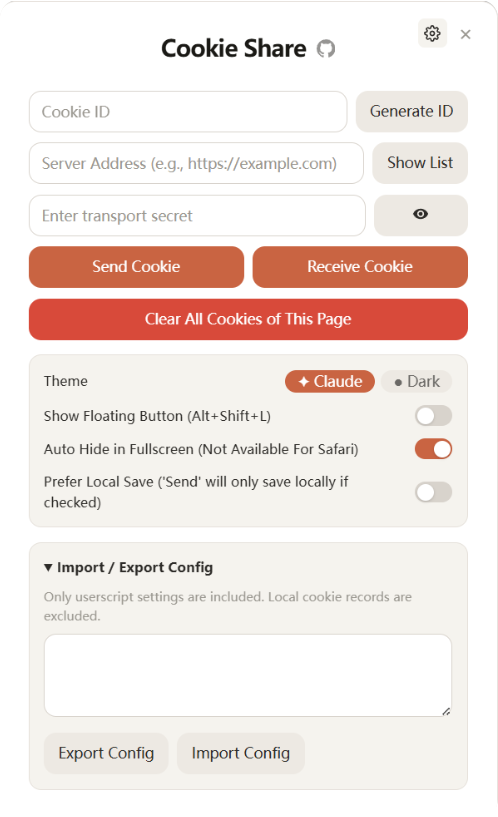
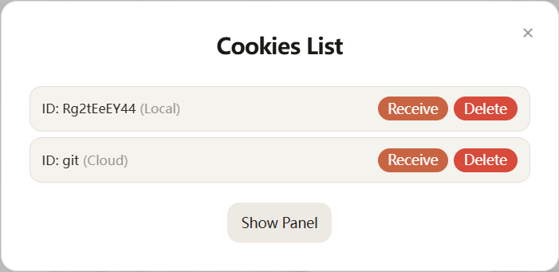
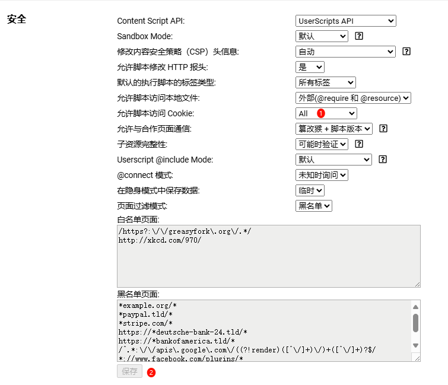

# Cookie-share Chrome/Edge/Firefox 扩展/油猴脚本

*注：仅供学习交流，严禁用于商业用途，请于24小时内删除，禁止在社交平台传播。如果本项目对你有用麻烦点个 star 这对我很有帮助，谢谢！*

[](https://github.com/fangyuan99/cookie-share)
   

**有问题请先看 [issues](https://github.com/fangyuan99/cookie-share/issues) | [discussions](https://github.com/fangyuan99/cookie-share/discussions)**

[English](./README.md) | [简体中文](./README_CN.md) | [Update Log](./update.md)

---

## 概述

Cookie-share 是一个 Chrome/Edge/Firefox 扩展 (同时也有 Tampermonkey 脚本)，允许用户在不同设备或浏览器之间发送和接收 cookies，可以用于**多账号切换、视频会员共享、星球合租**等场景。后端支持自建 Cloudflare Worker 或 Node.js 服务器，保障数据安全。



---



---


 [油猴脚本一键安装（推荐）](https://github.com/fangyuan99/cookie-share/raw/refs/heads/main/tampermonkey/cookie-share.user.js) | [镜像加速](https://fastly.jsdelivr.net/gh/https://github.com/fangyuan99/cookie-share/raw/refs/heads/main/tampermonkey/cookie-share.user.js) | [插件下载（不推荐，不再维护）](https://github.com/fangyuan99/cookie-share/releases)

### 效果与应用场景
**很多网站不支持多账号切换，不想退出重登？**

**开了视频会员，好兄弟老是让你扫码嫌麻烦？**

**开了某星球，和同学合租回回血？**

**单纯懒得掏出手机或者输密码换设备登录？**

1. 进入已登录网站的主页（任何含有 Cookie 的地址都可以）
2. 点击插件图标，自定义一个 ID（仅支持字母和数字），发送 Cookie
3. 没有登录的设备访问登录页，用刚刚的 ID 获取 Cookie，等待插件显示 Cookie 获取并设置成功后刷新网页即可

已测试的网站:
1. 某星球
2. 某艺
3. 某 L 站

## 功能

- 为 cookie 共享生成随机唯一 ID
- 将当前标签页的 cookies 发送到服务器
- 从服务器接收并设置 cookies 到当前标签页
- 在本地保存 cookies，无需后端（v0.1.0 新增）
- 通过 Cookie List 管理 cookies（区分本地与云端数据）
- 管理员功能，用于管理存储的 cookies
- 由于插件的权限更大，可以支持 JS 无法访问的 `HTTPOnly` Cookie

## 使用方法

### 油猴脚本使用方法（推荐）

1. 安装 [油猴](https://www.crxsoso.com/webstore/detail/dhdgffkkebhmkfjojejmpbldmpobfkfo) 或者其他脚本管理器:
2. [一键安装](https://github.com/fangyuan99/cookie-share/raw/refs/heads/main/tampermonkey/cookie-share.user.js) | [镜像加速](https://github.site/fangyuan99/cookie-share/raw/refs/heads/main/tampermonkey/cookie-share.user.js)
3. 若出现 cookie 权限问题，请在油猴设置中开启

1. 在已登录的浏览器页面发送 Cookie
2. 在未登录的浏览器页面接受 Cookie
3. 注意地址后面不要加 `/`，示例: `https://your-worker-name.your-subdomain.workers.dev/{PATH_SECRET}`

### 插件使用方法
1. 开启浏览器的开发者模式：
   - Chrome/Edge：访问 `chrome://extensions/`
   - Firefox：访问 `about:debugging#/runtime/this-firefox`
2. 加载扩展：
   - Chrome/Edge：将 `cookie-share.zip` 直接拖动到浏览器中
   - Firefox：临时加载 `cookie-share.xpi` 文件或从 Firefox 附加组件安装
3. 点击浏览器工具栏中的 Cookie-share 图标
4. 在已登录的浏览器页面发送 Cookie
5. 在未登录的浏览器页面接受 Cookie
6. 注意地址后面不要加 `/`，示例: `

### 后端部署指南

#### 选项 1: Cloudflare Worker (推荐)

[](https://deploy.workers.cloudflare.com/?url=https://github.com/fangyuan99/cookie-share&env=ADMIN_PASSWORD&env=PATH_SECRET&kv=COOKIE_STORE)

1. [注册](https://dash.cloudflare.com/sign-up) Cloudflare 账户并创建一个 Worker
2. 将 [_worker.js](./_worker.js) 的内容复制到新创建的 Worker 中
3. 在 Cloudflare Worker 设置中添加以下环境变量：
   - `ADMIN_PASSWORD`：设置一个强密码用于访问管理端点
   - `PATH_SECRET`：设置一个强字符串以防止暴力破解
   - `COOKIE_STORE`：创建一个 KV 命名空间用于存储 Cookie 数据
4. 在 Worker 设置中绑定 KV 命名空间：
   - 变量名称：`COOKIE_STORE`
   - KV 命名空间：选择您创建的 KV 命名空间
5. 保存并部署 Worker

如果您需要更高的性能或对数据存储有更多控制，可以部署独立的 Node.js 服务器：

#### 选项 2: Node.js 服务器

*注意：自建服务器可能会遭受攻击以及其他安全问题，请自行承担风险！*

1. [克隆](https://github.com/fangyuan99/cookie-share-server) cookie-share-server 代码仓库
2. 使用 `npm install` 安装依赖
3. 创建 `.env` 文件并包含以下变量：

   - `PORT`：服务器端口（默认为 3000）
   - `ADMIN_PASSWORD`：设置一个强密码用于管理员访问
   - `PATH_SECRET`：设置一个强字符串以防止暴力破解
   - `DB_PATH`：SQLite 数据库文件路径（默认为 ./data/cookie_share.db）
4. 使用 `npm start` 启动服务器
5. 通过 `http://your-server-ip:port/{PATH_SECRET}` 访问服务器

Node.js 服务器实现具有以下优势：
- Cookie 加密以增强安全性
- 持久化 SQLite 数据库存储
- 没有请求限制或存储配额
- 自托管，完全控制您的数据

### 无后端本地使用

从 v0.1.0 版本开始，Cookie-share 现在支持本地存储功能。这意味着您可以在不设置后端服务器的情况下使用该扩展：

- 勾选"保存到本地"复选框以将 Cookie 存储在本地
- Cookie 列表现在区分本地数据和云端数据
- 非常适合在单个设备上个人使用或高度关注隐私的场景

要在不同设备或浏览器之间共享 Cookie，您仍需要按照下文所述设置后端。

## 安全注意事项

- 确保 `ADMIN_PASSWORD` 设置为强密码并定期更改
- 不要在代码中硬编码 `ADMIN_PASSWORD`，始终使用环境变量
- 定期审查存储的数据，删除不必要的 Cookie 数据
- 考虑为 Cookie 数据设置过期时间，以降低长期存储敏感信息的风险
- 在 Worker 配置中使用 `PATH_SECRET` 以防止暴力破解攻击
- 设置复杂的项目名称并禁用内置的 workers.dev 域名

## 后端 API 端点

**如果 `/{PATH_SECRET}/admin/*` 端点出现问题，请检查是否添加了 X-Admin-Password 或使用 CF 官方 KV 管理页面**

两种后端实现均提供以下端点：

注意：添加 `X-Admin-Password: yourpassword`

示例：

`/{PATH_SECRET}/admin/list-cookies`

```sh
curl --location --request GET 'https://your-backend-address/{PATH_SECRET}/admin/list-cookies' \
--header 'X-Admin-Password: yourpassword'
```

`/{PATH_SECRET}/admin/delete`

```sh
curl --location --request DELETE 'https://your-backend-address/{PATH_SECRET}/admin/delete?key={yourid}' \
--header 'X-Admin-Password: yourpassword'
```

可用端点：
- `POST /{PATH_SECRET}/send-cookies`：存储与唯一 ID 关联的 Cookie
- `GET /{PATH_SECRET}/admin`：访问管理员管理页面
- `GET /{PATH_SECRET}/admin/list-cookies`：列出所有存储的 Cookie ID 和 URL
- `GET /{PATH_SECRET}/admin/list-cookies-by-host`：按主机名筛选列出 Cookie
- `DELETE /{PATH_SECRET}/admin/delete`：删除给定键的数据
- `PUT /{PATH_SECRET}/admin/update`：更新给定键的数据
- `OPTIONS /{PATH_SECRET}/`：处理 CORS 预检请求

管理员管理页面提供了用户友好的界面，用于管理 Cookie 和其他数据。包括查看所有存储的 Cookie、创建新的 Cookie 条目、更新现有 Cookie 以及删除单个 Cookie 或所有存储的数据。

要访问管理页面，请在浏览器中导航到 `https://your-backend-address/{PATH_SECRET}/admin`。访问管理界面前需要提供管理员密码。

**管理员端点需要使用管理员密码进行身份验证。**

## 文件结构

- `manifest.json`：扩展配置文件
- `popup.html`：扩展弹出窗口的 HTML 结构
- `popup.js`：用于处理用户交互和 Cookie 操作的 JavaScript
- `style.css`：弹出窗口的 CSS 样式
- `_worker.js`：用于后端操作的 Cloudflare Worker 脚本

## 开发

修改扩展：

1. 编辑相关文件（`popup.html`、`popup.js`、`style.css`）
2. 在 Chrome 中重新加载扩展以查看更改

修改后端：

1. 对于 Cloudflare Worker：编辑 `_worker.js` 文件并将更新后的 Worker 部署到 Cloudflare
2. 对于 Node.js 服务器：编辑 cookie-share-server 代码仓库中的文件

## 未来开发计划

- 未来更新将重点放在油猴脚本上，扩展暂时不更新

## 贡献

[aBER0724 (aBER)](https://github.com/aBER0724) - 贡献了最初的油猴脚本版本

欢迎贡献！随时提交 Pull Requests。

## Star History

[](https://star-history.com/#fangyuan99/cookie-share&Date)

## License

MIT
