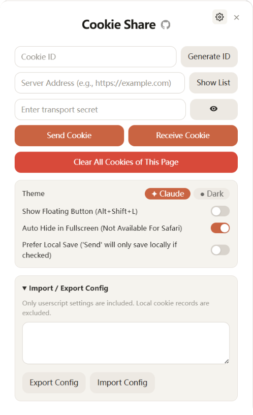
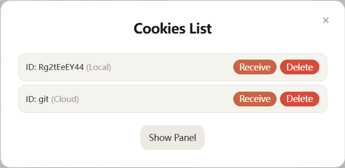
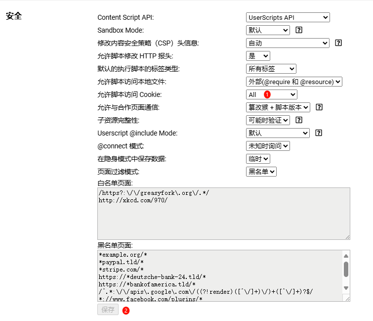

# Cookie-share

### 基于油猴脚本的跨设备 Cookie 共享工具

   

&nbsp;

[English](./README.md) | 简体中文 | [更新日志](./update.md)

&nbsp;

*注：仅供学习交流，严禁用于商业用途，请于24小时内删除，禁止在社交平台传播。如果本项目对你有用麻烦点个 star，这对我很有帮助，谢谢！*

**有问题请先看 [Issues](https://github.com/fangyuan99/cookie-share/issues) | [Discussions](https://github.com/fangyuan99/cookie-share/discussions)**

## 为什么选择 Cookie-share？

**很多网站不支持多账号切换，不想退出重登？**

**开了视频会员，好兄弟老是让你扫码嫌麻烦？**

**开了某星球，和同学合租回回血？**

**单纯懒得掏出手机或者输密码换设备登录？**

**Cookie-share** 用一个油猴脚本解决了这个问题。在已登录的浏览器发送 Cookie，在任意其他设备或浏览器一键接收——不需要密码、不需要扫码、不需要手动编辑。后端完全自建（Cloudflare Worker 或 Node.js 服务器），数据完全由你掌控。

- **一个脚本，通吃所有网站** — 只要网站使用 Cookie 认证就能用
- **跨设备共享** — 在台式机、笔记本、手机浏览器之间共享登录会话
- **纯本地模式** — 无需后端，在本地保存 Cookie，适合单设备多账号切换
- **HTTPOnly 支持** — 可以访问普通页面 JS 无法触及的 `HTTPOnly` Cookie
- **自建后端** — Cloudflare Worker (D1) 或 Node.js 服务器，数据不经过第三方
- **加密传输** — 所有云端操作使用 `TRANSPORT_SECRET` 加密信封

## 截图

  
  
<em>主面板 — 发送、接收 Cookie 与偏好设置</em>

   
  
  
<em>Cookie 列表 — 管理本地与云端数据</em>

## 功能

### 核心功能

- 为 Cookie 共享生成随机唯一 ID
- 将当前标签页的 Cookie 发送到服务器
- 从服务器接收并设置 Cookie 到当前标签页
- 支持普通页面 JS 无法访问的 `HTTPOnly` Cookie
- 管理员面板管理所有存储的 Cookie

### 存储

- 在本地保存 Cookie，无需后端（v0.1.0+）
- 通过 Cookie List 管理 Cookie（区分本地与云端数据）
- 云端存储通过自建 Cloudflare Worker (D1) 或 Node.js 服务器

### 界面与主题

- 双主题支持：Claude（暖色浅色）和 Dark（奢华金色暗色），一键切换（v0.4.0+）
- 油猴脚本配置导出 / 导入，Base64 剪贴板传递（v0.3.1+）

---

## 快速上手

1. **安装**：安装 [油猴](https://www.crxsoso.com/webstore/detail/dhdgffkkebhmkfjojejmpbldmpobfkfo)，然后 [一键安装脚本](https://github.com/fangyuan99/cookie-share/raw/refs/heads/main/tampermonkey/cookie-share.user.js)（[镜像加速](https://fastly.jsdelivr.net/gh/https://github.com/fangyuan99/cookie-share/raw/refs/heads/main/tampermonkey/cookie-share.user.js)）
2. **发送**：在已登录的页面打开 Cookie-share 面板，设置自定义 ID，点击"发送 Cookie"
3. **接收**：在另一个设备 / 浏览器访问同一网站的登录页，输入相同 ID，点击"接收 Cookie"，然后刷新

> 如果只在本地使用（无需后端），勾选"保存到本地"即可。跨设备共享请先部署后端——见下文。

---

## 使用方法

### 油猴脚本

1. 安装 [油猴](https://www.crxsoso.com/webstore/detail/dhdgffkkebhmkfjojejmpbldmpobfkfo) 或其他脚本管理器
2. [一键安装](https://github.com/fangyuan99/cookie-share/raw/refs/heads/main/tampermonkey/cookie-share.user.js) | [镜像加速](https://github.site/fangyuan99/cookie-share/raw/refs/heads/main/tampermonkey/cookie-share.user.js)
3. 若出现 Cookie 权限问题，请在油猴设置中开启：
   
4. 在已登录的浏览器页面发送 Cookie
5. 在未登录的浏览器页面接收 Cookie
6. 注意地址末尾不要加 `/`，示例：`https://your-worker-name.your-subdomain.workers.dev/{PATH_SECRET}`
7. 如果你使用 Cloudflare Worker 后端，油猴脚本只需要填写地址和 `Transport Secret`。发送、接收、云端列表、云端删除都会使用同一个 `TRANSPORT_SECRET`
8. 管理面板：`https://your-worker-name.your-subdomain.workers.dev/{PATH_SECRET}/admin`，使用 `ADMIN_PASSWORD` 登入

### 无后端本地使用

从 v0.1.0 版本开始，Cookie-share 支持本地存储。无需后端服务器即可使用：

- 勾选"保存到本地"复选框以将 Cookie 存储在本地
- Cookie 列表区分本地数据和云端数据
- 非常适合在单个设备上个人使用或高度关注隐私的场景

要在不同设备或浏览器之间共享 Cookie，仍需按照下文部署后端。

---

## 后端部署

### 选项 1: Cloudflare Worker + D1（推荐）

> **注意：v0.4.1 版本后使用 D1 数据库，不兼容旧版（KV）数据。如果你是从旧版本升级，需要重新部署并迁移数据。**

#### 一键部署（推荐）：

1. 点击上面的 Deploy 按钮并授权 Cloudflare
2. 在部署表单中填写 `ADMIN_PASSWORD`、`PATH_SECRET` 和 `TRANSPORT_SECRET`
3. 完成部署后，Cloudflare 会自动创建并绑定名为 `COOKIE_DB` 的 D1 数据库
4. 不需要手动创建 KV 或绑定 D1；Worker 会在第一次写入时自动创建所需表结构
5. 在油猴脚本中使用 `https://your-worker-domain/{PATH_SECRET}` 作为后端地址

#### 通过 Wrangler 本地部署：

1. 执行 `npm install`
2. 执行 `npx wrangler login`
3. 复制 `.dev.vars.example` 为 `.dev.vars`，用于本地开发
   - 如果没有 `.dev.vars`，`wrangler dev` 在 localhost 下会自动回落到 `PATH_SECRET=dev`、`ADMIN_PASSWORD=dev-password` 和 `TRANSPORT_SECRET=dev-transport-secret`
4. 生产部署前先设置远端密钥：
   - `npx wrangler secret put ADMIN_PASSWORD`
   - `npx wrangler secret put PATH_SECRET`
   - `npx wrangler secret put TRANSPORT_SECRET`
5. 执行 `npm run deploy`
6. 可选：首次部署完成后执行 `npm run db:migrate`，让 Wrangler 的 D1 migration 元数据也同步创建

仓库已在 [wrangler.jsonc](./wrangler.jsonc) 中声明了 D1 绑定，Cloudflare 在部署时可以自动创建并绑定数据库。

### 选项 2: Node.js 服务器

*注意：自建服务器可能会遭受攻击以及其他安全问题，请自行承担风险！*

内置 Node.js 后端要求 Node.js `22.5.0+`，因为它使用的是内置 `node:sqlite` 模块，而不是额外的原生依赖。

1. 进入仓库内置的 Node.js 后端目录：`cd server`
2. 使用 `npm install` 安装依赖
3. 复制 `.env.example` 为 `.env`
4. 在 `.env` 中配置以下变量：
   - `PORT`：服务器端口（默认为 3000）
   - `ADMIN_PASSWORD`：设置一个强密码用于管理员访问
   - `PATH_SECRET`：设置一个强字符串以防止暴力破解
   - `TRANSPORT_SECRET`：设置一个强字符串用于脚本与后端之间的加密传输
   - `DB_PATH`：SQLite 数据库文件路径（默认为 `./data/cookie_share.db`）
5. 开发环境使用 `npm run dev`，生产环境使用 `npm run build && npm start`
6. 通过 `http://your-server-ip:port/{PATH_SECRET}` 访问服务器

Node.js 服务器的优势：

- Cookie 加密以增强安全性
- 持久化 SQLite 数据库存储
- 没有请求限制或存储配额
- 自托管，完全控制数据

---

## 安全注意事项

- 确保 `ADMIN_PASSWORD` 设置为强密码并定期更改
- 确保 `TRANSPORT_SECRET` 足够随机，并与管理员密码独立轮换
- 不要在代码中硬编码 `ADMIN_PASSWORD`，始终使用环境变量
- 不要复用 `ADMIN_PASSWORD` 作为传输加密密钥
- 定期审查 D1 中存储的数据，删除不必要的 Cookie 数据
- 考虑为 Cookie 数据设置过期时间，以降低长期存储敏感信息的风险
- 在 Worker 配置中使用 `PATH_SECRET` 以防止暴力破解攻击
- 设置复杂的项目名称并禁用内置的 workers.dev 域名

---

## 常见问题

为什么获取不到 HTTPOnly Cookie？

请确保在油猴设置中开启了相关权限。进入油猴管理面板 → 设置 → 确认脚本的 Cookie 访问权限已开启。

不部署后端也能用吗？

可以。从 v0.1.0 起，勾选"保存到本地"即可在纯本地模式下使用 Cookie-share。后端仅在跨设备 / 跨浏览器共享时才需要。

ADMIN_PASSWORD、PATH_SECRET 和 TRANSPORT_SECRET 有什么区别？

- `PATH_SECRET`：URL 路径的一部分，防止未授权访问 Worker 端点
- `ADMIN_PASSWORD`：用于管理页面的身份验证
- `TRANSPORT_SECRET`：用于油猴脚本与 Worker 之间的数据传输加密

油猴脚本只需要 `TRANSPORT_SECRET`，管理页只需要 `ADMIN_PASSWORD`，两者应该设置为不同的值。

升级到 v0.4.1+ 后旧数据不见了？

v0.4.1 将存储从 Cloudflare KV 切换到了 D1 数据库，数据格式不兼容。需要重新部署 Worker 并重新发送 Cookie，没有从 KV 到 D1 的自动迁移。

---

后端 API 端点

**如果 `/{PATH_SECRET}/admin/*` 端点出现问题，请先确认是否带上了 `X-Admin-Password`，并检查 `ADMIN_PASSWORD` 与 `PATH_SECRET` 是否配置正确。**

两种后端实现均提供以下端点：

注意：
- `GET /{PATH_SECRET}/admin` 是明文 HTML 页面
- `OPTIONS` 仍然是明文 CORS 预检
- 油猴脚本相关 JSON 接口使用基于 `TRANSPORT_SECRET` 的加密信封
- 管理页相关 JSON 接口使用 `ADMIN_PASSWORD` 同时完成鉴权和页面侧加密
- 油猴脚本和管理页会自动处理加解密；如果直接用 `curl`，需要自己实现对应的客户端加密逻辑

可用端点：
- `POST /{PATH_SECRET}/send-cookies` — 存储与唯一 ID 关联的 Cookie
- `GET /{PATH_SECRET}/receive-cookies/{id}` — 读取指定 ID 的 Cookie
- `GET /{PATH_SECRET}/list-cookies-by-host/{host}` — 油猴脚本云端列表接口
- `DELETE /{PATH_SECRET}/delete?key={id}` — 油猴脚本云端删除接口
- `GET /{PATH_SECRET}/admin` — 打开管理页面
- `GET /{PATH_SECRET}/admin/list-cookies` — 列出所有存储的 Cookie ID 和 URL
- `GET /{PATH_SECRET}/admin/list-cookies-by-host` — 按主机名筛选列出 Cookie
- `POST /{PATH_SECRET}/admin/create` — 从管理页创建记录
- `DELETE /{PATH_SECRET}/admin/delete` — 删除给定键的数据
- `PUT /{PATH_SECRET}/admin/update` — 更新给定键的数据
- `GET /{PATH_SECRET}/admin/export-all` — 导出全部记录为加密 JSON
- `POST /{PATH_SECRET}/admin/import-all` — 导入加密 JSON，并按 ID 执行 upsert
- `OPTIONS /{PATH_SECRET}/` — 处理 CORS 预检请求

管理页面提供了用户友好的界面，用于管理 Cookie 和其他数据。要访问管理页面，在浏览器中打开 `https://your-backend-address/{PATH_SECRET}/admin`。管理页只需要 `ADMIN_PASSWORD`；油猴脚本只需要 `TRANSPORT_SECRET`。

**所有 `/admin/*` API 端点都需要使用管理员密码进行身份验证。**

文件结构

- `server/` - 内置的 TypeScript Node.js 后端与 SQLite 存储
- `tampermonkey/cookie-share.user.js` — 油猴脚本
- `_worker.js` — 用于后端操作的 Cloudflare Worker 脚本
- `wrangler.jsonc` — Cloudflare Worker 与 D1 配置
- `migrations/0001_init.sql` — 初始 D1 表结构
- `.dev.vars.example` — 本地开发变量示例
- `package.json` — Wrangler 相关脚本

开发

**修改脚本：**

1. 编辑 `tampermonkey/cookie-share.user.js`
2. 在 Tampermonkey 中重新安装或刷新脚本以验证更改

**修改后端：**

1. 对于 Cloudflare Worker：编辑 `_worker.js`，使用 `npm run check` 校验后，再执行 `npm run deploy`
2. 如需显式应用仓库中的 SQL migration，可在 Worker 已存在后执行 `npm run db:migrate`
3. 对于 Node.js 服务器：编辑 `server/src` 中的文件，然后执行 `cd server && npm run build && npm test`

发布前 Smoke Checklist

- 通过 Cloudflare Deploy 按钮部署，并确认 D1 数据库被自动创建和绑定
- 完整验证 `POST /send-cookies -> GET /receive-cookies/{id} -> GET /admin/list-cookies -> GET /admin/list-cookies-by-host/{host} -> PUT /admin/update -> DELETE /admin/delete -> GET /admin/export-all -> POST /admin/import-all`
- 验证当 `TRANSPORT_SECRET` 缺失或错误时，油猴脚本的云端操作会明确失败
- 验证非法 ID、缺失 key、非法 URL、错误的 cookie JSON、错误管理密码都返回预期的 4xx
- 打开 `/{PATH_SECRET}/admin`，确认 Pico CSS 管理页的刷新、删除、导出、导入都正常
- 确认油猴脚本仍能同时显示本地 / 云端数据，并且空列表时不再报错

---

## 贡献

[aBER0724 (aBER)](https://github.com/aBER0724) — 贡献了最初的油猴脚本版本

欢迎贡献！随时提交 Pull Requests。

## Star History

## License

MIT
